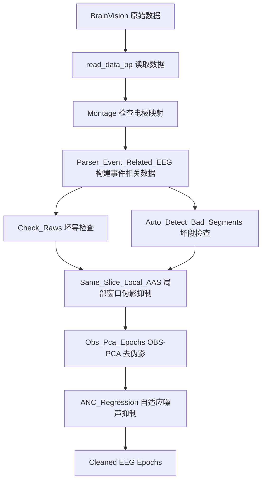

# Stroke

Stroke MI Model Program, including EEG and MRI modules.

## EEG Preprocessing Module

当前文件主要对应 EEG 预处理部分，基于 MNE-Python 实现：

- BrainVision 原始数据读取
- 坏导快速检查
- 坏段快速报告
- EEG 去噪 Pipeline

## 文件结构

```text
.
├── main.py
└── tools
    ├── parser.py
    ├── preprocessing.py
    └── readeeg.py
```

## 关键函数调用

### 1. 读取 BrainVision 原始数据信息

```python
from tools import read_data_bp

raw_eeg_data, raw = read_data_bp("x.vhdr")
```

返回值：

```python
raw_eeg_data: np.ndarray
raw: mne.Info
```

### 2. 检查电极与 10-20 标准蒙太奇映射

```python
from tools import Montage

Montage(raw, show=True)
```

功能说明：

- 检查当前 EEG 电极名称
- 映射到 10-20 标准电极系统
- 可视化电极空间分布

### 3. 构建 Event-related EEG 数据结构

```python
events_eeg = Parser_Event_Related_EEG(
    "x.vhdr",
    "x.vmrk",
    sample_rate,
    duration
)
```

输出数据结构：

```python
events_eeg: np.ndarray
# shape: [n_events, n_channels, n_samples]
```

### 4. 坏导检查

```python
from tools import Check_Raws

Check_Raws(raw, sfreq)
```

参数说明：

```python
raw: mne.Info
sfreq: int
```

功能说明：

- 快速检查异常导联
- 辅助定位坏导或噪声较大的通道

### 5. 坏段检查

```python
from tools import Auto_Detect_Bad_Segments

Auto_Detect_Bad_Segments(
    events_eeg,
    sfreq,
    mode="uV"
)
```

参数说明：

```python
events_eeg: np.ndarray
sfreq: int
mode: str  # "uV" or "V"
```

功能说明：

- 对事件相关 EEG 数据进行坏段检测
- 支持微伏 `"uV"` 和伏特 `"V"` 两种幅值单位模式

### 6. 局部窗口内 AAS

```python
Same_Slice_Local_AAS(
    events_eeg,
    labels
)
```

参数说明：

```python
events_eeg: np.ndarray
# shape: [n_events, n_channels, n_samples]

labels: np.ndarray
# shape: [n_events, 2]
# each row: [start_index_time, sample_times]
```

说明：

> 该函数开发时主要面向同步 EEG-fMRI 场景设计，因此后续需要根据当前任务进行适配改造。

### 7. OBS-PCA

```python
Obs_Pca_Epochs(
    eeg_data,
    mode,
    components
)
```

参数说明：

```python
eeg_data: np.ndarray
mode: str
components: int
```

输出逻辑：

```text
mode == "A"  -> 输出 artifacts-epochs
其他 mode    -> 输出 cleaned-epochs
```

说明：

- `components` 用于定义伪影特征数量
- 默认建议范围：`1-3`

### 8. ANC 自适应噪声抑制

```python
ANC_Regression(
    eeg_data,
    reference_eeg_data
)
```

参数说明：

```python
eeg_data: np.ndarray
reference_eeg_data: np.ndarray
```

说明：

- `reference_eeg_data` 通常选择参考电极、ECG 电极或 EMG 电极
- 用于自适应回归去除参考噪声成分

## 推荐处理流程



## 注意事项

- BrainVision 数据读取通常需要 `.vhdr`、`.vmrk` 和 `.eeg` 文件保持同目录且路径引用正确。
- `Same_Slice_Local_AAS` 原始设计面向同步 EEG-fMRI 采集场景，独立 EEG 数据或其他采集协议下需要重新确认 `labels` 的含义。
- OBS-PCA 中 `components` 不宜盲目设置过大，建议从 `1-3` 开始验证。
- ANC 需要合理选择参考信号，常见参考包括 ECG、EMG 或特定噪声参考电极。
- 所有自动坏导、坏段检测结果建议结合可视化结果进行人工复核。
